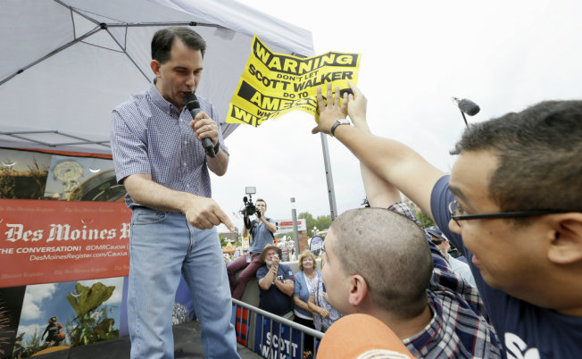

I am not going to lie, it was a  good day. I felt like I was freaking
brothers every way like MJ.

I got Scott Walker to do three days of double talk in a week.

I have been using the super power of the Bald Spot and the energy from the sun
to get him to keep flubbing on this Trump created madness about "anchor babies".

So last Monday, the meat suit said was at the Iowa State fair and parroted The
Trump that birthright citizenship should be ended.

Then on Tuesday, the Koch brothers must have called because he ended up on Fox
News and waffled. " “I believe (in) securing the border, enforcing the laws. … I do not believe in amnesty going forward. I believe in a legal immigration system that gives priority to American working families and their wages in a way that will improve the American economy.”

Then today, on Sunday, he went onto ABC to say “enforce the laws, including those that are in the Constitution.”

So yeah, today was a good day. The meat suit flip flopped like a fish on a pier.

Music I listened to, of course, Girl Talk's [Triple Double](https://www.youtube.com/watch?v=i0yY0zxk-18&t=3m36s)

[Fox News](http://www.foxnews.com/politics/2015/08/23/walker-appears-to-take-third-stance-in-seven-days-on-birthright-citizenship/) on the flopping.
